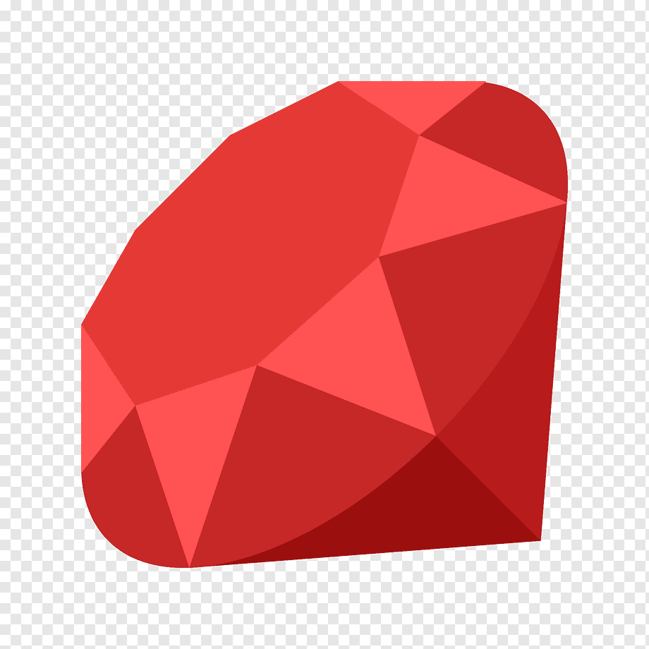

# Hi there, I'm Sharad 👋

## My Stack 👉 

- currently adding redux  and jest to my skillset

## Interested in developing ...

- videochat apps
- music production apps

## 🔭 I’m currently working on ...

- migrating a react chat app to redux 

## 🌱 I’m currently learning ...

- redux 🦆  🦆  🦆 

<!--
**s-satsangi/s-satsangi** is a ✨ _special_ ✨ repository because its `README.md` (this file) appears on your GitHub profile.

Here are some ideas to get you started:

- 👯 I’m looking to collaborate on ...
- 🤔 I’m looking for help with ...
- 💬 Ask me about ...
- 📫 How to reach me: ...
- 😄 Pronouns: ...
- ⚡ Fun fact: ...
-->
